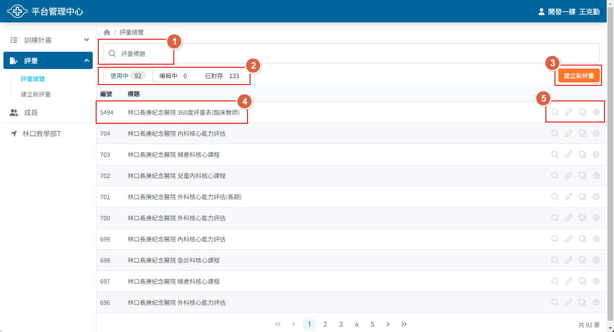
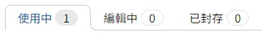
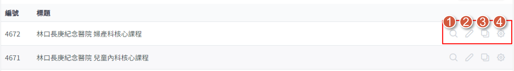

## 操作路徑

左側選單 > ```評量```

## 畫面說明



1. 評量標題搜尋
2. 評量使用狀態標籤
3. 建立新評量連結按鈕
4. 評量編號與標題
5. 評量管理快速操作功能

## 評量使用狀態



- 使用中
  - **會出現**在新增評量的選項中
  - 代表這個評量在學員或教師新增教學紀錄時可被選擇
  
- 編輯中
  - **不會出現**在新增評量的選項中
  - 代表這個評量還沒編輯完成，暫時無法被用在教學紀錄中

- 已封存
  - **不會出現**在新增評量的選項中
  - 代表這個評量已經不再被使用

## 評量管理快速操作



1. 檢視評量
    - 可快速查看這個評量的呈現內容

2. 編輯評量
    - 進入評量編輯頁面來調整評量內容
3. 複製評量
    - 複製現有評量並成為一份新的評量
    - 如果多份評量的內容相似，即可透過此功能來提升建置效率
4. 評量設定
    - 可快速修改評量的標題、說明及使用狀態
