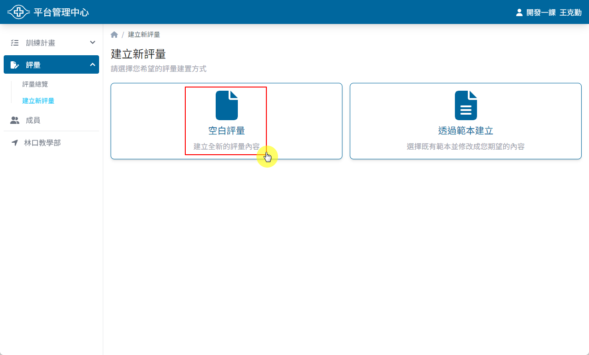
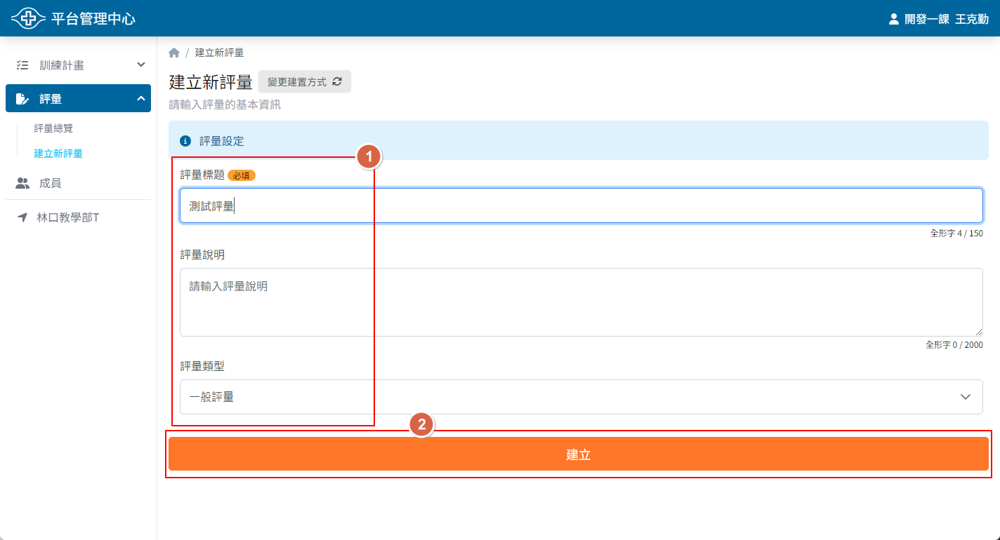

## 操作路徑

1. 左側選單 > ```評量``` > ```建立新評量``` > ```空白評量```
2. ```評量總覽``` > 右上角 > ```建立新評量``` > ```空白評量```

## 操作方式

1. 輸入評量標題與說明
2. 點選 ```建立``` 按鈕
3. 選擇是否要繼續編輯內容
    - ```是```：進入評量編輯頁面
    - ```否```：回到評量總覽頁面




