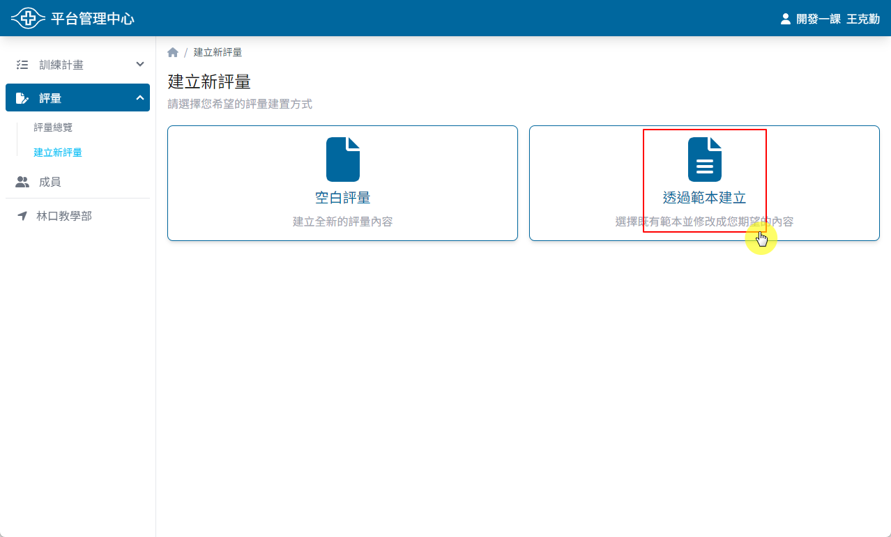
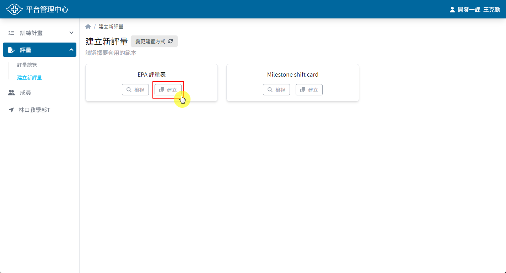

## 操作路徑

1. 左側選單 > ```評量``` > ```建立新評量``` > ```透過範本建立```
2. ```評量總覽``` > 右上角 > ```建立新評量``` > ```透過範本建立```

## 操作方式

1. 選擇要複製的範本
2. 點選 ```建立``` 按鈕
3. 建立成功後即可進入評量編輯頁面

::: tip
可以先在各項評量中點選 ```檢視``` 按鈕，確認範本內容是否符合需求
:::




