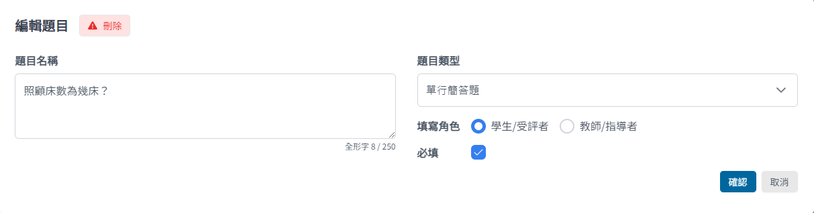
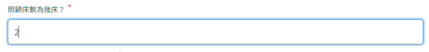
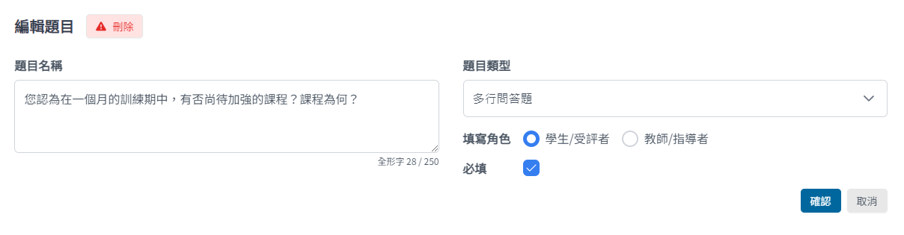
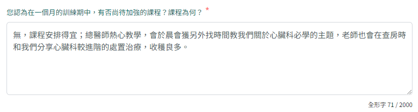
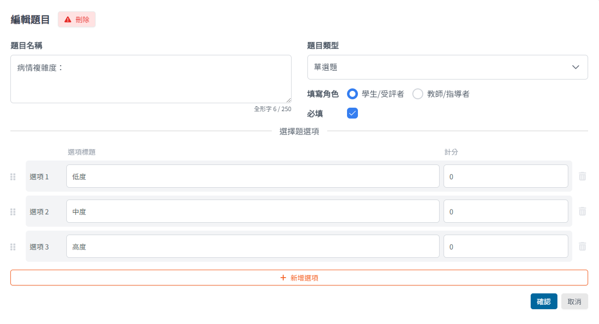
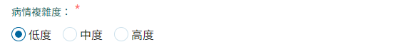
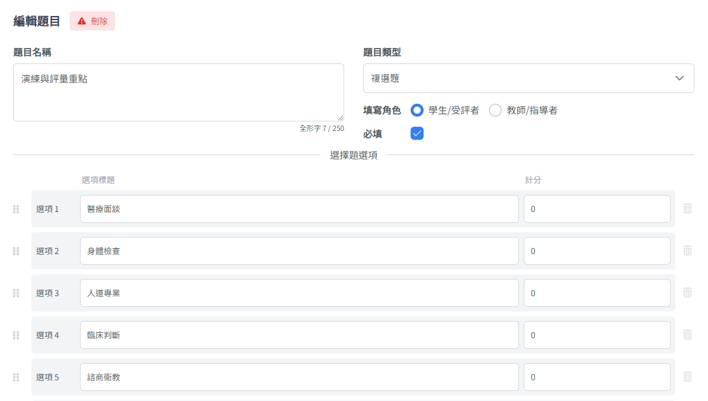
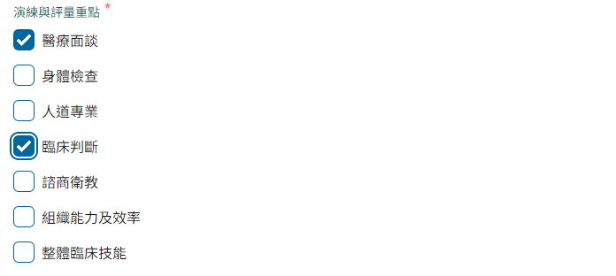

目前系統共提供單行簡答題、多行問答題、單選題、複選題等四個基礎題型。

## 單行簡答題

- 適合沒有固定答案，且答題內容不多的情境
- 文字輸入上限為 **100 個全形字**

## 多行問答題

- 適合沒有固定答案，需要填寫較多文字的情境
- 文字輸入上限為 **2000 個全形字**

## 單選題

- 適合有多個固定答案，且只能從中選擇一項的情境
- 建立時需同時設定選項

## 複選題

- 適合有多個固定答案，且可以從中選擇多項的情境
- 建立時需同時設定選項

