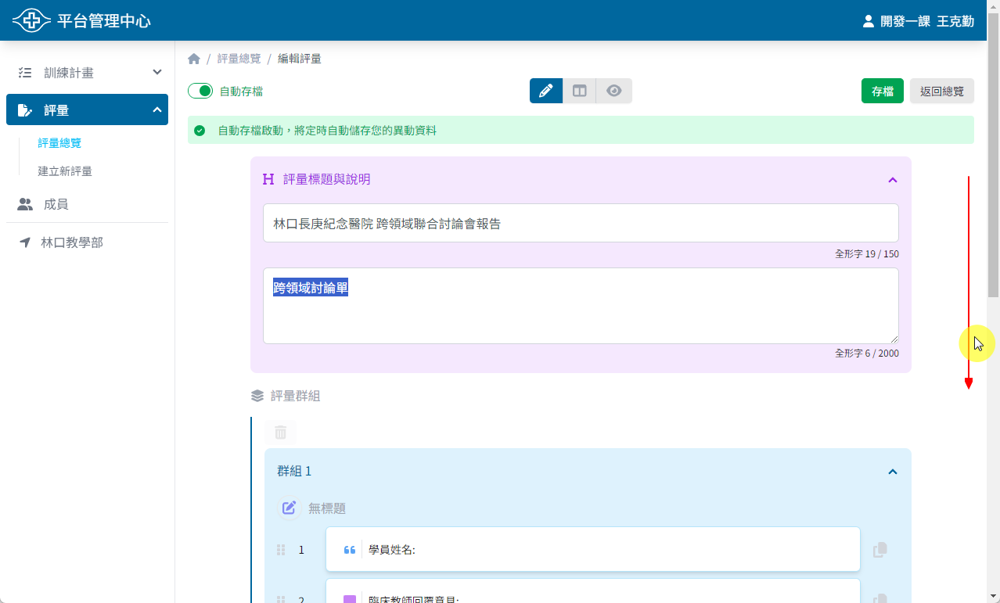
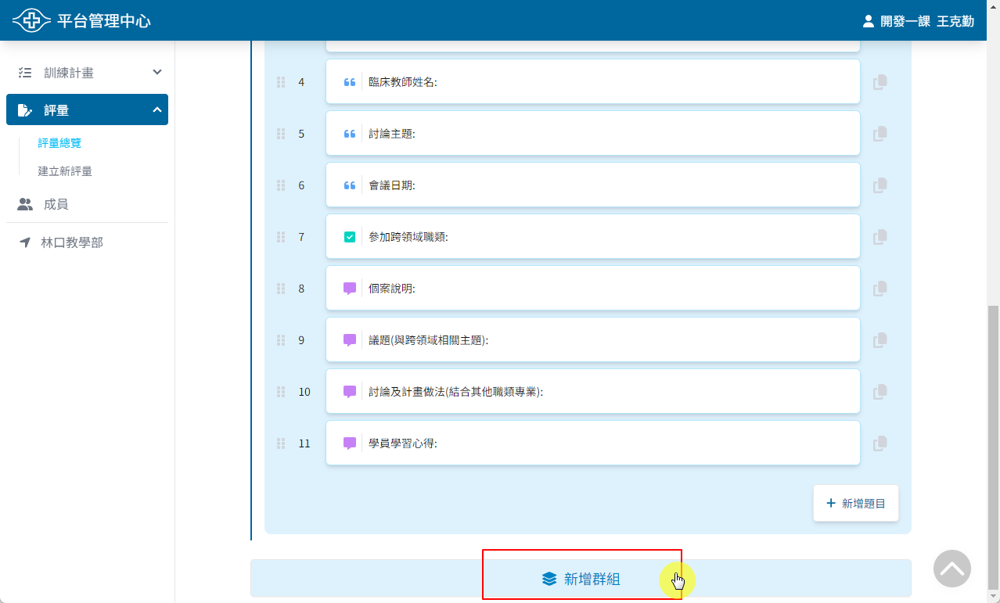
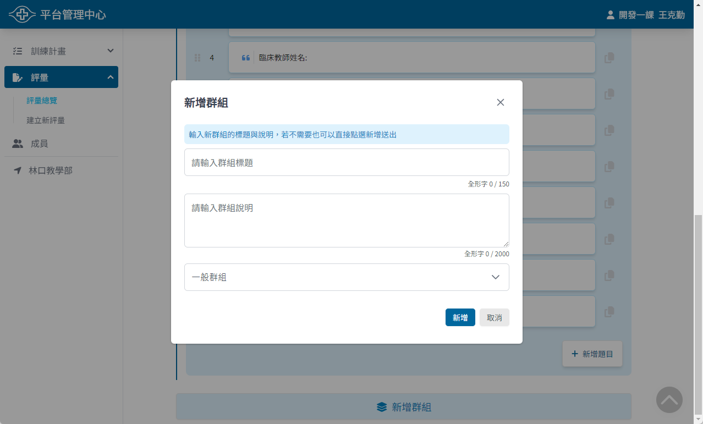
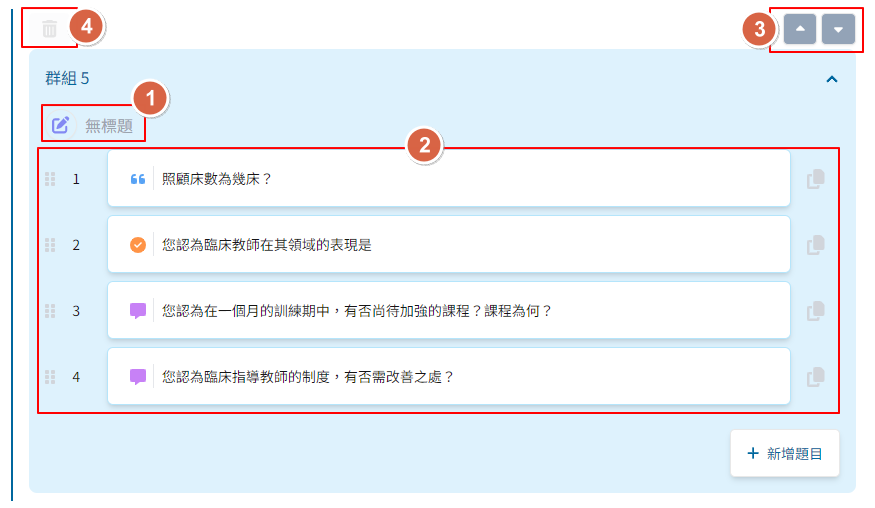
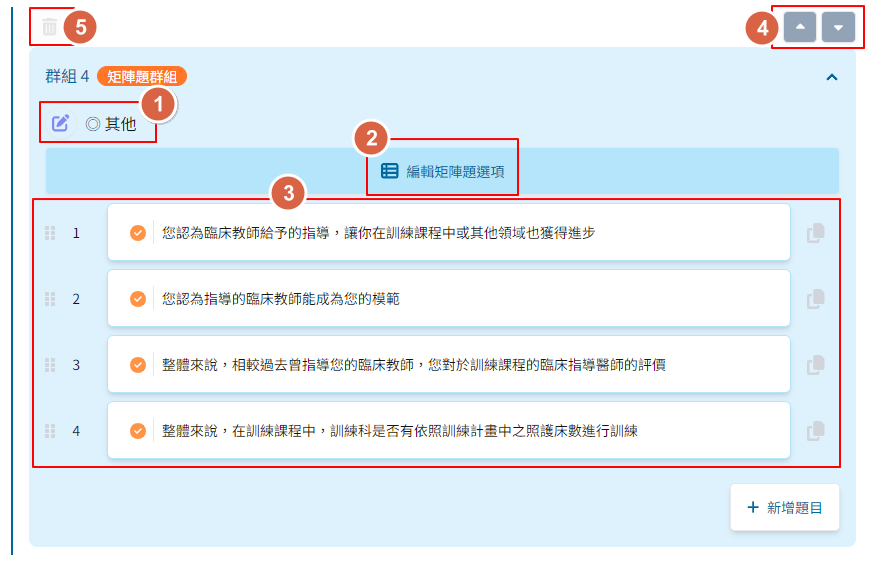

## 新增群組

1. 在評量編輯內容頁面中，將畫面往下捲動至最下方

    

2. 點選 ```新增群組``` 按鈕以開啟建立群組視窗

    

3. 輸入群組資訊並選擇群組類型，點選 ```新增``` 按鈕完成群組建立

    

## 群組類型

目前系統提供以下兩種群組類型：

1. 一般群組 <Badge text="預設" />
2. 矩陣題群組

::: warning
群組一經建立後即不可修改類型，如欲變更類型請重新建立一個新的群組，再將原群組刪除
:::

## 一般群組

預設的群組類型，可用來包含一般的評量題目。



1. 群組的標題與編輯按鈕，點選後可編輯群組的標題與說明
2. 隸屬於這個群組的題目
3. 調整群組順序按鈕，可透過按鈕來將群組往上或往下移動
4. 刪除群組按鈕，點選後可刪除這個群組

::: danger
刪除群組將會一併刪除群組內的所有題目，請謹慎操作！
:::

## 矩陣題群組

矩陣題群組可以讓群組內的所有單選題共用同一組選項，特別適合用在滿意度調查等多個題目具有重複選項的情境。



1. 群組的標題與編輯按鈕，點選後可編輯群組的標題與說明
2. 編輯矩陣題選項按鈕，點選後可開啟矩陣題選項編輯視窗
3. 隸屬於這個群組的題目
4. 調整群組順序按鈕，可透過按鈕來將群組往上或往下移動
5. 刪除群組按鈕，點選後可刪除這個群組

::: danger
刪除群組將會一併刪除群組內的所有題目，請謹慎操作！
:::
