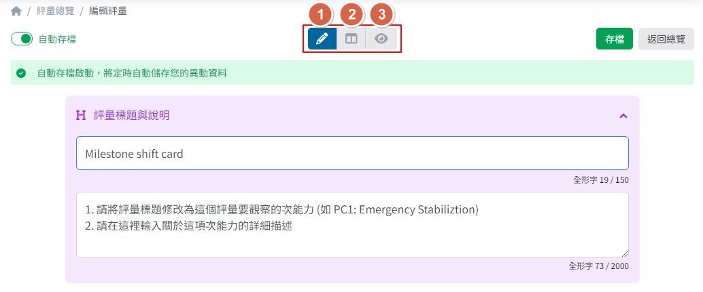
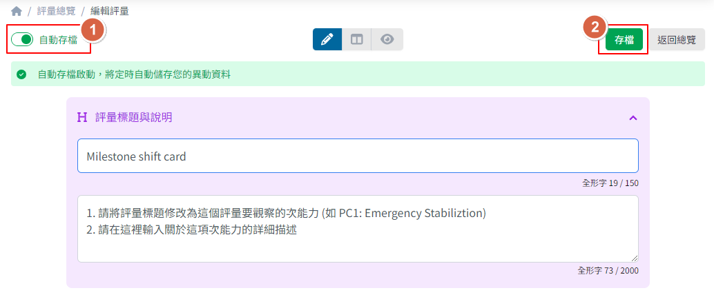

## 操作模式切換

在評量內容編輯的畫面中可以隨時切換成以下三種模式：

1. 編輯 <Badge text="預設" />
2. 同步顯示
3. 瀏覽



## 存檔

- 系統預設會開啟自動存檔，並於每 5 分鐘存檔一次
- 如果不想要使用自動存檔，也可以在畫面左上角切換 ```自動存檔開關``` 來關閉功能
- 無論自動存檔或手動存檔狀態，皆可隨時點選畫面右上角的 ```存檔``` 按鈕手動儲存


