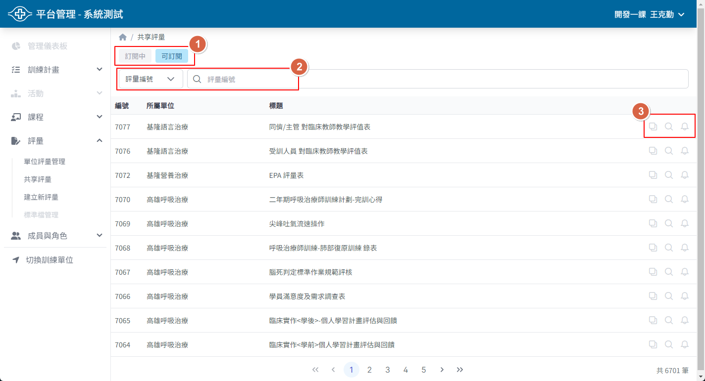
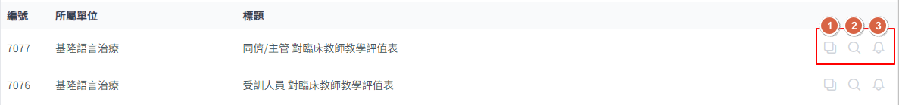

## 操作路徑

左側選單 > ```評量``` > ```共享評量```

## 畫面說明



1. 訂閱中、可訂閱列表切換
2. 評量關鍵字搜尋
3. 共享評量快速操作功能

## 共享評量快速操作



1. 複製評量
    - 可將這份評量複製到您的單位中，由單位管理與修改
    - 如果沒有看到複製按鈕，代表這份評量的所屬單位不開放複製
2. 檢視評量
    - 可快速查看這份評量的呈現內容
3. 訂閱/取消訂閱
    - 訂閱這份評量後，您就可以在單位的訓練中使用，但是評量的管理與編輯權限仍屬於原所屬單位
    - 如不需要使用這份評量，可點選取消訂閱
