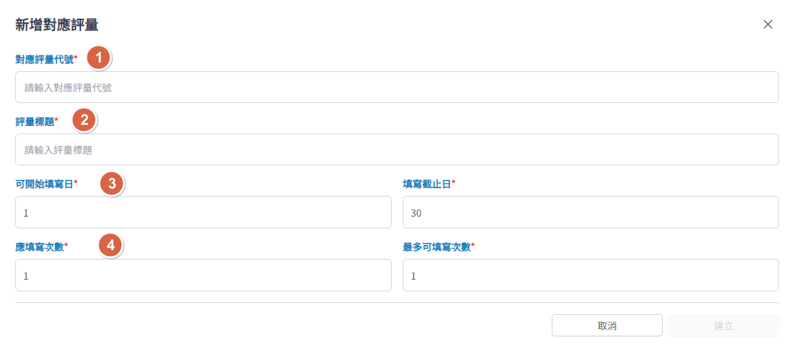

## 操作路徑

左側選單 > ```計畫總覽``` > 點選要查詢的計畫進入計畫頁面 > 上方頁籤 > ```訓練項目``` >

點選要查詢的項目進入項目頁面 > 上方頁籤 > ```對應評量``` > 評量列表右下方 > ```新增對應評量```

## 畫面說明



1. 對應評量代號
    - ==必填==
    - 請填入使用您的訓練單位已建立評量的評量代號
2. 評量標題
    - ==必填==
    - 於訓練計畫中，可與原本的評量名稱不同
3. 可開始填寫日與填寫截止日
    - ==必填==
    - 只能填數字
4. 應填寫次數與最多可填寫次數
    - ==必填==
    - 只能填數字
    - 若將**應填寫次數設為 0**，即可將評量設為選填評量
