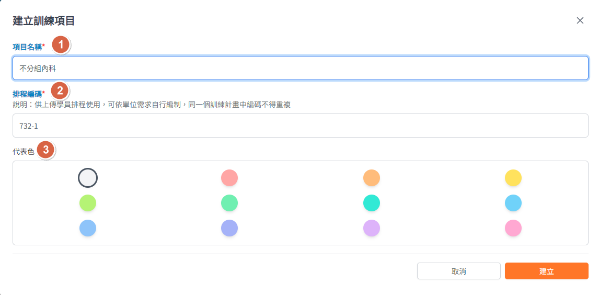

## 操作路徑

左側選單 > ```計畫總覽``` > 點選要查詢的計畫進入計畫頁面 > 上方頁籤 > ```訓練項目``` > ```建立訓練項目```

## 畫面說明



1. 項目名稱
   - ==必填==

2. 排程編碼
   - ==必填==
   - 供學員排程上傳使用
   - 系統預設會自動產生，亦可依單位訓練需求自行編排
   - 同個訓練計畫中的排程代碼不得重複

3. 代表色
    - 非必填，預設為淺灰色
    - 當有多個訓練項目時，可透過代表色來協助辨識
