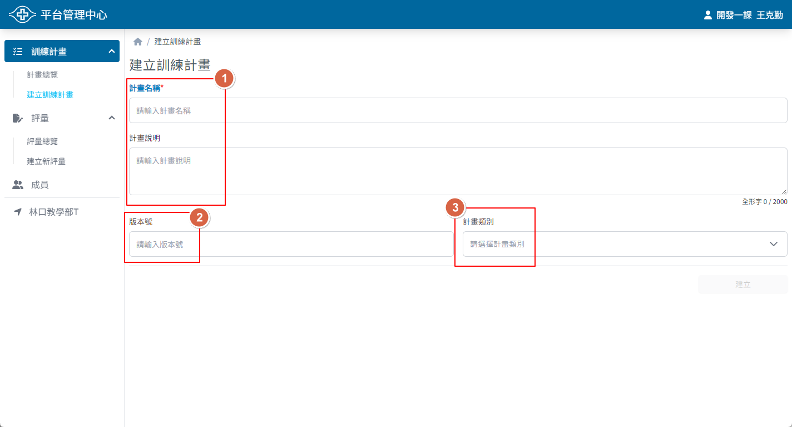

## 操作路徑

1. 左側選單 > ```訓練計畫``` > ```建立訓練計畫```
2. ```計畫總覽``` > 右上角 > ```建立訓練計畫```

## 操作方式

1. 輸入計畫名稱與說明
2. 版本號
   - 非必填
   - 如果有多個訓練計畫需使用同一名稱，可輸入版本號
   - 日後即可利用計畫名稱與版本號方式來區別
3. 選擇計畫類別
   - 非必填
   - 可協助分類不同階段的訓練
   - 可與評量及課程搭配，依類別給予不同權限設定
4. 點選 ```建立``` 按鈕
5. 選擇是否要繼續編輯內容
    - ```是```：進入計畫設定頁面
    - ```否```：回到計畫總覽頁面


