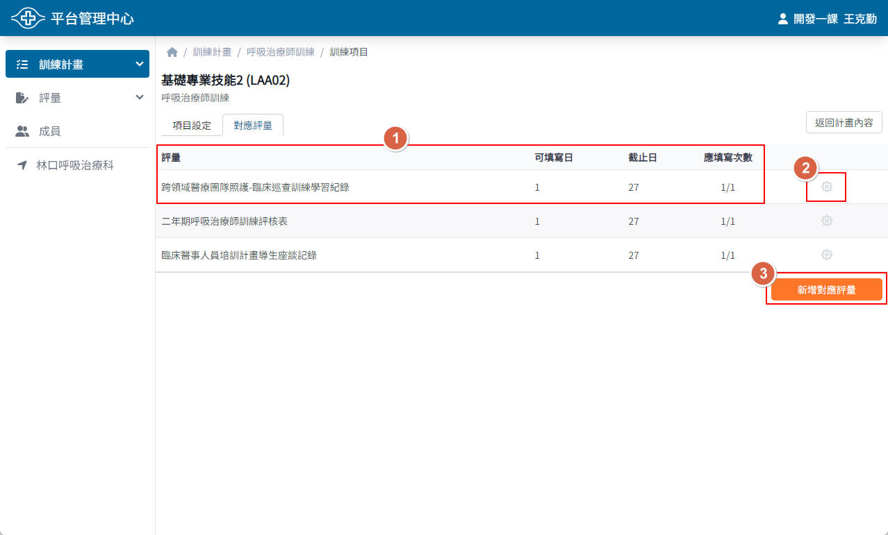

## 操作路徑

左側選單 > ```計畫總覽``` > 點選要查詢的計畫進入計畫頁面 > 上方頁籤 > ```訓練項目``` >

點選要查詢的項目進入項目頁面 > 上方頁籤 > ```對應評量```

## 畫面說明



1. 評量標題與填寫設定
    - 可填寫日：

      評量在訓練項目中可以開始填寫的時間，例如可填寫日為 1，代表訓練項目開始的**第 1 天即可填寫**

    - 截止日：

      評量在訓練項目中最後可以填寫的時間，例如截止日為 27，代表訓練項目開始的**第 28 天(含)後不得填寫**

    - 應填寫次數：

      由 最少應填寫次數/最多可填寫次數 組成，例如應填寫次數為 1/3，代表該評量**至少要填寫 1 次**，**最多則可填寫到 3 次**
2. 編輯對應評量按鈕，點擊後可開啟評量設定視窗
3. 新增對應評量按鈕，點擊後可開啟新增評量視窗
