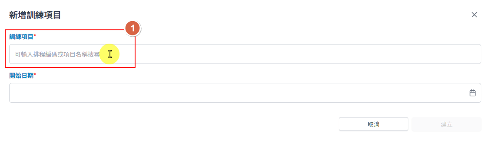
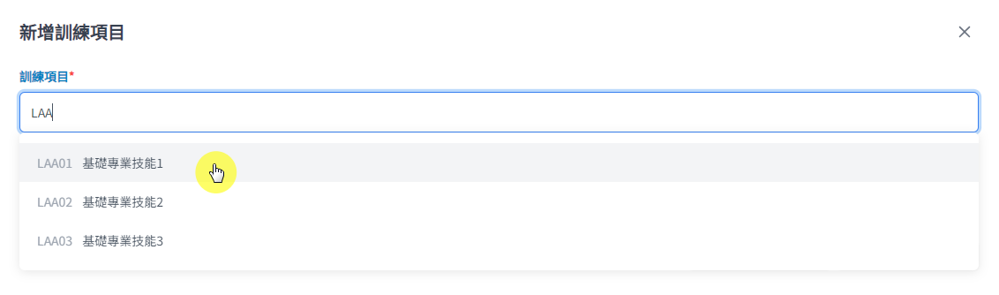
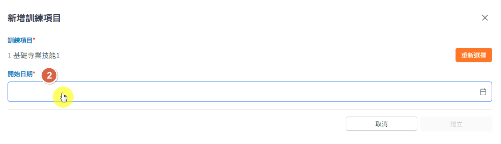
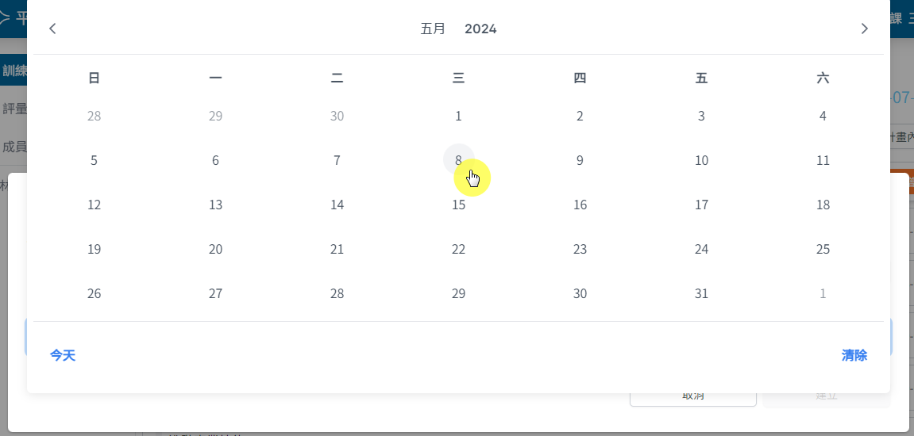

## 操作路徑

左側選單 > ```計畫總覽``` > 點選要查詢的計畫進入計畫頁面 > 上方頁籤 > ```學員``` >

點選要新增訓練項目的學員 > 上方頁籤 > ```訓練排程``` > 右上角 > ```新增```

## 操作方式

1. 在新增項目輸入框輸入訓練計畫項目的編碼或名稱關鍵字來搜尋符合條件的訓練項目

    

    

2. 點選開始日期輸入框，進入日期選擇視窗，選擇訓練項目的開始日期

    

    

3. 點選 ```建立``` 按鈕及完成訓練項目新增
