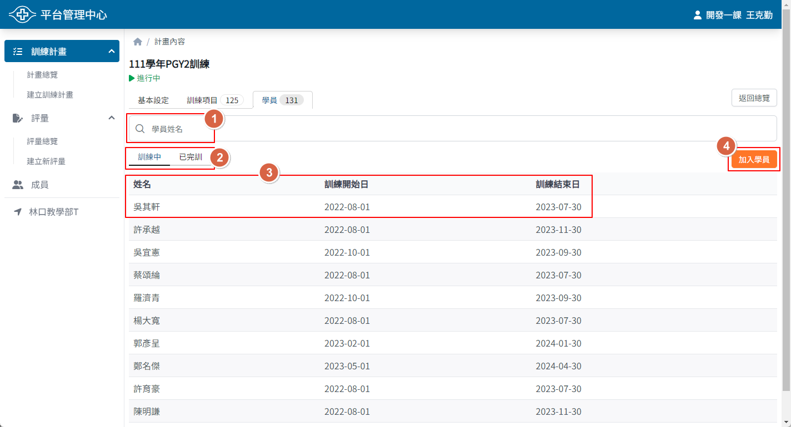

## 操作路徑

左側選單 > ```計畫總覽``` > 點選要查詢的計畫進入計畫頁面 > 上方頁籤 > ```學員```

## 畫面說明



1. 學員姓名搜尋

    一個訓練計畫可能有數十名甚至百名學員參與，可以利用姓名搜尋功能快速找到指定學員

2. 學員訓練狀態標籤

    訓練計畫中的每位學員訓練起訖時間可能不同，當學員訓練完畢後可將其移至已完訓名單，並透過頁籤切換查看不同狀態的學員

3. 學員訓練摘要

    點擊後可進入訓練排程頁面

4. 加入學員按鈕

    點擊後可開啟加入學員視窗
